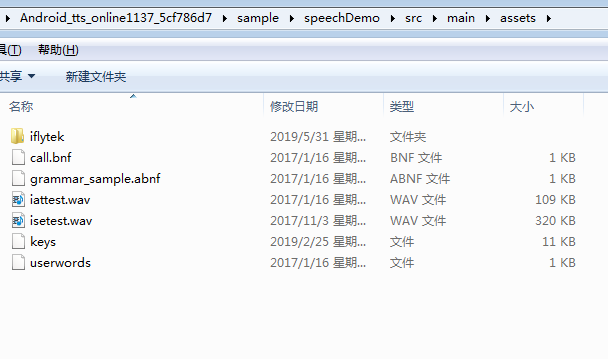
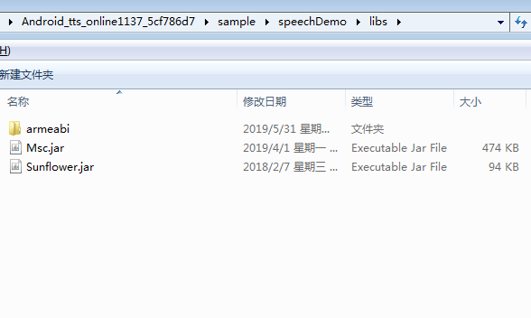
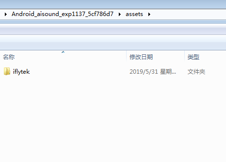
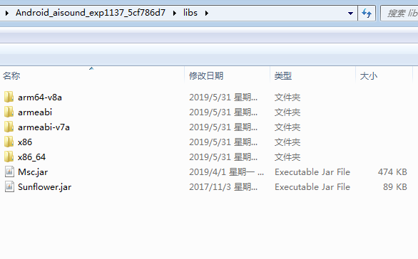

# 科大讯飞语音合成

语音合成，又称文语转换（Text to Speech，TTS）技术，涉及声学、语言学、数字信号处理、计算机科学等多个学科技术，
是中文信息处理领域的一项前沿技术，解决的主要问题是如何将文字信息转化为可听的声音信息，也即“让机器像人一样开口说话”。

科大讯飞在2006年至2014年，已连续九届英文语音合成国际大赛（Blizzard Challenge）荣获第一名。
科大讯飞语音合成技术代表着当今世界最高水平，占据语音合成市场70%以上份额，并且在电信、邮政、金融、能源、交通，政府等领域得到成功应用。

SDK在集成开发测试阶段服务量限制为最高500次/每日，完成提额申请或商务合作后可以解除。

[](https://www.xfyun.cn/doccenter/tts)

[语音合成](https://doc.xfyun.cn/msc_android/%E8%AF%AD%E9%9F%B3%E5%90%88%E6%88%90.html)

[Android_SDK相关问题和答案汇总](http://bbs.xfyun.cn/forum.php?mod=viewthread&tid=24442&extra=page%3D1)


> 在线合成语音
基于云端处理，将文本信息转换为声音信息。
提供中英粤多语种、川豫多方言、男女声多风格的选择，音量、语速、音高等参数也支持动态调整，快速构建个性化声音；
运行资源占用小，同时安装包尺寸仅为1M，平均每字流量消耗低于100B！






> 离线合成语音
将资源封装在SDK中，无需流量，基于本地处理，将文字信息转化为声音信息。






# 模块化多application：

参考：

[rongkun/ComponentJava](https://github.com/rongkun/ComponentJava)

[ DRPrincess/DRComponentDemo](https://github.com/DRPrincess/DRComponentDemo)


每个【应用模块】下的application的name都设置为BaseApplication：
``` 
<application
    android:name="com.example.base.BaseApplication"
    android:allowBackup="true"
    android:icon="@mipmap/ic_launcher"
    android:label="@string/app_name"
    android:roundIcon="@mipmap/ic_launcher_round"
    android:supportsRtl="true"
    android:theme="@style/AppTheme"
    tools:ignore="AllowBackup,GoogleAppIndexingWarning">
</application>
```
BaseApplication中使用反射通过接口动态初始化各个模块的application：
``` 
private void modulesApplicationInit(){
    for (String moduleImpl : ModuleConfig.MODULESLIST){
        try {
            Class<?> clazz = Class.forName(moduleImpl);
            Object obj = clazz.newInstance();
            if (obj instanceof ApplicationImpl){
                ((ApplicationImpl) obj).onCreate(this);
            }
        } catch (ClassNotFoundException e) {
            e.printStackTrace();
        } catch (IllegalAccessException e) {
            e.printStackTrace();
        } catch (InstantiationException e) {
            e.printStackTrace();
        }
    }
}
```

# 权限问题

``` 
java.lang.SecurityException: 
com.example.mytts was not granted  this permission: 
android.permission.WRITE_SETTINGS.
```

在这里，Write_setting有个坑，申请了write_setting权限后，也出现闪退的情况，异常为：
java.lang.IllegalArgumentException: You cannot keep your settings in the secure settings.

在android 6.0及以后，WRITE_SETTINGS权限的保护等级已经由原来的dangerous升级为signature，
这意味着我们的APP需要用系统签名或者成为系统预装软件才能够申请此权限，
并且还需要提示用户跳转到修改系统的设置界面去授予此权限

也就是说，要想申请该权限，apk必须要打包，签名打包。要签名打包，最喜欢的debug模式是不能申请该权限。


